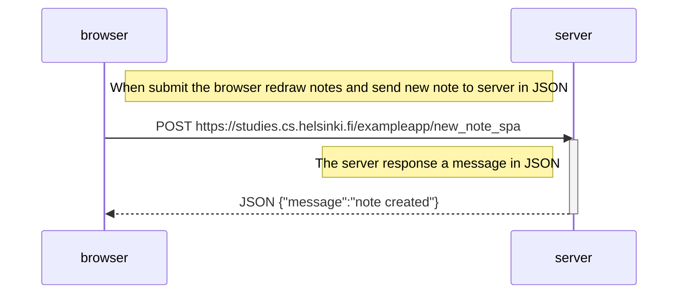

```mermaid
sequenceDiagram

    participant browser
    participant server

    Note right of browser: When submit the browser redraw notes and send new note to server in JSON
    browser->>server: POST https://studies.cs.helsinki.fi/exampleapp/new_note_spa
    activate server
    Note left of server: The server response a message in JSON
    server-->>browser: JSON {"message":"note created"}
    deactivate server

```